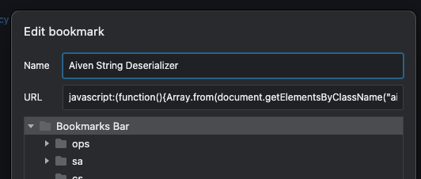
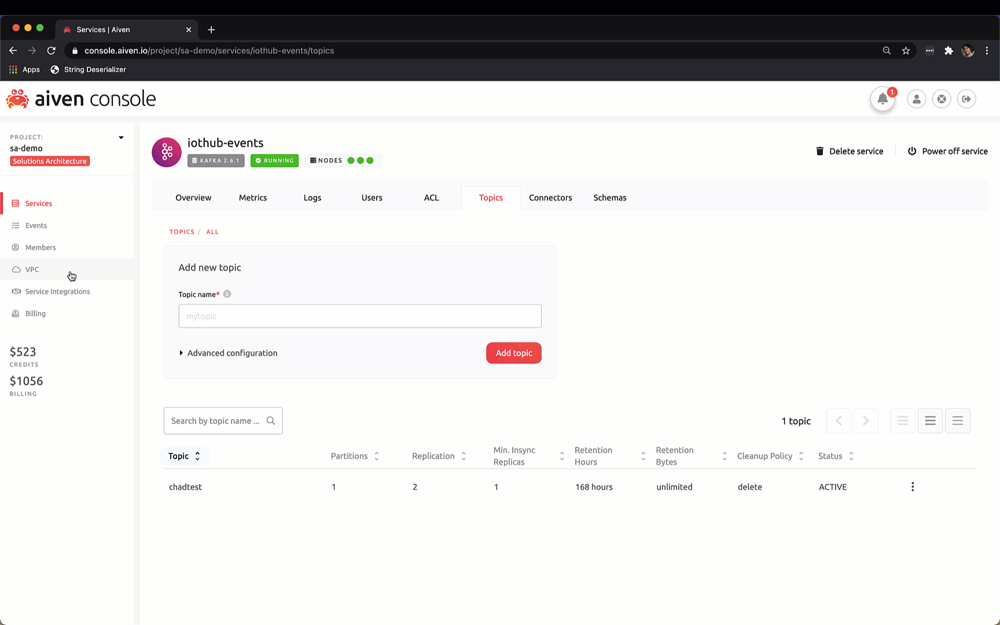

# Aiven Kafka String Deserializer Bookmarklet

## Install The Bookmarklet

Create a new bookmark in your browser with the following link.

```js
javascript: (function () {
  Array.from(document.getElementsByClassName('aiven-JSONTree-string')).forEach(
    (ele) => {
      try {
        ele.innerText = atob(JSON.parse(ele.innerText));
      } catch (err) {}
    },
  );
})();
```



## Use the Bookmarklet

Navigate to the kafka service and view messages using the
`binary` deserializer. This encodes the keys and messages
in Base64.

Now press the bookmarklet to view the keys and messages in
plain text.


